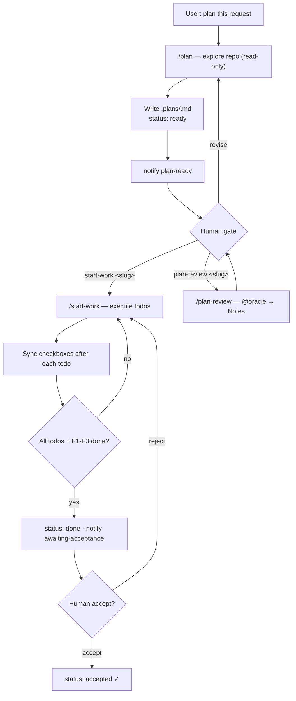

# omo-slim-plan

Lightweight **plan-first** workflow for [OpenCode](https://opencode.ai) + [oh-my-opencode-slim](https://github.com/sisyphuslabs/omo): AI writes a decision-complete plan first, a human chooses what happens next, execution updates checkboxes in the plan file, and webhook notifications (Telegram primary, extensible) fire at the gate points. Not full omo/ultrawork — no boulder, no dual-review, no CAS.

```
/plan  →  .plans/<slug>.md (status: ready)  →  human gate
              │
              ├─ start-work <slug>   → execute, sync checkboxes
              │         └─ all done  → awaiting-acceptance  → human accept  → status: accepted
              ├─ plan-review <slug>  → @oracle review → Notes → back to gate
              └─ revise              → edit plan, stay ready
```

## Features

- **`/plan`** — explore the repo, write a decision-complete plan to `.plans/<slug>.md`, set `status: ready`, stop for a human choice. Never implements product code.
- **`/start-work`** — execute an existing plan, update `- [ ]` → `- [x]` after each verified todo, present an acceptance summary when done, wait for human accept/reject.
- **`/plan-review`** — delegate plan review to the `oracle` agent, write findings into the plan `## Notes`, return to the human gate.
- **Checkbox progress as source of truth** — the plan file is the only progress ledger; no completion claims without checked boxes.
- **Telegram + extensible webhooks** — Telegram Bot API by default; generic JSON POST; local command provider; all behind a small provider map you can extend.

## Requirements

- OpenCode + oh-my-opencode-slim (agents: explorer / fixer / designer / oracle / librarian)
- Node.js **18+** (installer and plugin use only `node:` builtins — zero npm runtime dependencies)

## Install

```bash
npx omo-slim-plan
# or from GitHub
npx github:Daedalusys/omo-slim-plan
```

From a local checkout:

```bash
node bin/install.js            # install
node bin/install.js --dry-run  # preview only
node bin/install.js --help
```

What the installer does:

| Step | Destination |
|------|-------------|
| Commands | `~/.config/opencode/command/{plan,start-work,plan-review}.md` |
| Skill | `~/.config/skillshare/skills/plan-workflow/SKILL.md` if skillshare exists, else `~/.config/opencode/skills/plan-workflow/` |
| Plugin | `~/.config/opencode/plugin/{planflow.js,planflow-notify.mjs,planflow-providers.mjs}` |
| Config | `~/.config/opencode/planflow.json` (created if missing; never clobbered unless `--force`) |
| Plugin registration | `"planflow"` added to the `plugin` array in `~/.config/opencode/opencode.json` |

`OPencode_CONFIG` overrides the config root. `--config <path>` sets it too (directory, or a `planflow.json` path). Existing targets are backed up to `*.bak-<timestamp>` before overwrite. After install: **restart OpenCode**.

## Configure Telegram (first run)

You only need a **bot token** first. `chat_id` is captured interactively — no manual lookup.

1. Talk to [@BotFather](https://t.me/BotFather) → `/newbot` → copy the **bot token**.
2. Install / run setup (chat_id optional on the command line):

```bash
npx omo-slim-plan --telegram-token "123456:ABC-your-token"
# re-run anytime
npx omo-slim-plan --setup-telegram
```

3. The installer calls Telegram `getMe`, prints your bot username, and asks you to **message the bot** (any text, e.g. `/start`).
4. It polls `getUpdates` and shows the captured message:

```text
捕获到消息:
  chat_id   : 123456789
  chat_type : private
  from      : lofibass (@lofibass)
  text      : hi
```

5. Confirm `[Y/n]` → `chat_id` is saved to `~/.config/opencode/planflow.json` (`provider=telegram`).
6. A test message (`Telegram 配置成功`) is sent to verify the path.

If provider is `telegram` but `chatId` is empty, notifications report `telegram_not_configured` until setup completes — re-run `--setup-telegram`.

Manual config still works: set `webhook.telegram.botToken` + `chatId` in `planflow.json`, or pass both flags:

```bash
node bin/install.js --telegram-token "123456:ABC..." --telegram-chat-id "-1001234567890"
```

### Event toggles

| event | default | when |
|-------|---------|------|
| `plan-ready` | on | plan written, `status: ready` |
| `awaiting-review` | on | `/plan-review` starts (oracle review) |
| `task-done` | off | each todo completed during `/start-work` |
| `awaiting-acceptance` | on | all Todos + Final checks done |
| `test` | n/a | setup test notification (always allowed) |

Set any event to `false` to silence it. **A missing/unconfigured provider never blocks the workflow** — notify failures are logged and work continues.

## Custom webhook providers

Provider map lives in `plugin/planflow-providers.mjs`:

```js
export const PROVIDERS = {
  telegram: telegramProvider,  // POST api.telegram.org
  generic: genericProvider,    // POST JSON to webhook.generic.url
  command: commandProvider,    // run local command via spawn
};
```

### Generic provider

```json
"webhook": {
  "provider": "generic",
  "generic": {
    "url": "https://example.com/hooks/planflow",
    "headers": { "Authorization": "Bearer ..." }
  }
}
```

Payload shape:

```json
{
  "event": "plan-ready",
  "plan": ".plans/foo.md",
  "title": "[omo-slim-plan] Plan ready: foo",
  "message": "Plan .plans/foo.md status: ready",
  "remaining": 3,
  "session": "",
  "source": "omo-slim-plan"
}
```

### Command provider

```json
"webhook": {
  "provider": "command",
  "command": { "cmd": "curl -s -X POST -d \"$PLANFLOW_MESSAGE\" https://example.com/hook" }
}
```

- Executes with `spawn` (non-interactive, 10s timeout). **No shell interpolation of untrusted text into the command** — values go through env only:
  - `PLANFLOW_EVENT`, `PLANFLOW_PLAN`, `PLANFLOW_TITLE`, `PLANFLOW_MESSAGE`, `PLANFLOW_REMAINING`
- Optional placeholders in `cmd`: `{{event}}`, `{{plan}}`, `{{title}}`, `{{message}}`, `{{remaining}}` — substituted only from the same caller-controlled safe strings, shell-escaped.

### Adding your own provider

1. Write `async function myProvider(cfg, payload) { return { ok: true }; }` in `planflow-providers.mjs`.
2. Register it: `export const PROVIDERS = { ..., my: myProvider }`.
3. Set `"webhook": { "provider": "my", "my": { ... } }` in `planflow.json`.

Contract: return `{ ok, skipped?, reason?, status?, error? }`; never throw; treat missing config as `{ ok: false, reason: "my_not_configured" }`.

## Workflow overview



Plan file contract (excerpt):

```markdown
# my-feature
- status: ready
- created: 2026-01-01
- slug: my-feature

## TL;DR
## Scope
## Must-NOT
## Todos
- [ ] 1. <title>
  - 验收: <agent-executable criteria>
  - 证据: <exact command or path>
## Final checks
- [ ] F1. 计划符合度
- [ ] F2. 质量与测试通过
- [ ] F3. 与 Scope/Must-NOT 一致
## Notes
```

Status machine: `draft → ready → (approved) → in-progress → done → accepted`.

Full contract: the installed **plan-workflow** skill (`~/.config/opencode/skills/plan-workflow/SKILL.md` or skillshare equivalent).

## Plans convention (`.plans/`)

- One plan per file: `.plans/<slug>.md` (lowercase-hyphen slug).
- Located in **each project's** project root — the installer never drops plans into random projects.
- **Default: commit plans** into the project repo (they are small and reviewable). Do **not** commit boulder-style heavy artifacts. Teams that want plans local-only can gitignore `.plans/`.
- See `templates/plans/README.md` for the copy-able directory README.

## Uninstall

```bash
npx omo-slim-plan --uninstall
# or from a checkout
node bin/install.js --uninstall
```

Removes installed commands, the skill, plugin files, and `"planflow"` from `opencode.json`'s plugin array. **Keeps `planflow.json`** (your tokens) unless you pass `--force`. Project `.plans/` directories are never touched.

## Security

- **Never commit `planflow.json`** — it may contain Telegram bot tokens or webhook URLs. The file lives in `~/.config/opencode/`, outside your project repo.
- Tokens are never logged by the plugin (provider errors are redacted).
- Command-provider messages are passed via environment variables, not interpolated into the command string.
- The installer refuses to write outside your OpenCode config root and skillshare root; every overwrite is backed up first.
- Notifications are best-effort side channels: an unconfigured or failing webhook never blocks plan/execute/acceptance.

## License

MIT © 2026 omo-slim-plan maintainers
